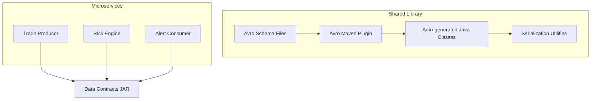

# CodedStreams Crypto Risk Contract Library


A shared Java library providing Avro-based data contracts for the CodedStreams Crypto Trading Platform. This library ensures type safety and schema consistency across all microservices in the risk control ecosystem.

## 📋 Overview

The CodedStreams Crypto Risk Contract Library serves as the single source of truth for all data schemas used in the crypto trading risk control system. It provides:

- **Avro Schema Definitions** for trade events and risk alerts
- **Auto-generated Java Classes** for type-safe data handling
- **Serialization Utilities** for efficient Avro binary encoding
- **Schema Evolution** support for backward/forward compatibility

## 🏗️ Architecture



## 📦 Schemas

### CryptoTrade Schema
Represents cryptocurrency trading events with comprehensive risk metadata.

**Key Fields:**
- `tradeId`: Unique trade identifier
- `userId`: User identifier for risk tracking
- `symbol`: Trading pair (e.g., "BTC/USDT")
- `side`: BUY or SELL
- `quantity`: Trade quantity in base asset
- `price`: Trade price in quote asset
- `notional`: Calculated value (quantity × price)
- `timestamp`: Event timestamp in milliseconds
- `riskLevel`: Initial risk assessment (LOW, MEDIUM, HIGH, CRITICAL)

### RiskAlert Schema
Represents risk alerts generated by the Flink CEP engine.

**Key Fields:**
- `alertId`: Unique alert identifier
- `severity`: Alert severity level (LOW, MEDIUM, HIGH, CRITICAL)
- `patternType`: Risk pattern that triggered the alert
- `userId`: User who triggered the alert
- `description`: Human-readable alert description
- `recommendedAction`: Suggested mitigation steps
- `triggeredEvents`: Map of events that triggered the pattern

### PlatformMetadata Schema
Common metadata for platform-wide event tracing and versioning.

## 🚀 Quick Start

### Prerequisites

- Java 11 or higher
- Maven 3.6+
- Access to company Maven repository (or local installation)

### Installation

1. **Clone the repository:**
   ```bash
   git clone https://github.com/codedstreams/crypto-risk-contract-library.git
   cd crypto-risk-contract-library
   ```

2. **Build and install locally:**
   ```bash
   mvn clean install
   ```

3. **Add dependency to your project:**
   ```xml
   <dependency>
       <groupId>com.codedstreams</groupId>
       <artifactId>crypto-risk-contract-library</artifactId>
       <version>1.0.2</version>
   </dependency>
   ```

## 💻 Usage

### Basic Serialization/Deserialization

```java
import com.codedstreams.contracts.avro.CryptoTrade;
import com.codedstreams.contracts.avro.RiskAlert;
import com.codedstreams.contracts.AvroSerialization;

// Create a trade event
CryptoTrade trade = CryptoTrade.newBuilder()
    .setTradeId("trade-12345")
    .setUserId("user-001")
    .setCustomerId("cust-1001")
    .setSymbol("BTC/USDT")
    .setBaseAsset("BTC")
    .setQuoteAsset("USDT")
    .setSide(CryptoTrade.TradeSide.BUY)
    .setOrderType(CryptoTrade.OrderType.LIMIT)
    .setQuantity(0.5)
    .setPrice(45000.0)
    .setNotional(22500.0)
    .setTimestamp(System.currentTimeMillis())
    .setExchange("BINANCE")
    .setRiskLevel(CryptoTrade.RiskLevel.LOW)
    .build();

// Serialize to byte array
byte[] serializedTrade = AvroSerialization.serializeTrade(trade);

// Deserialize from byte array
CryptoTrade deserializedTrade = AvroSerialization.deserializeTrade(serializedTrade);
```

### Kafka Producer Example

```java
@Component
public class TradeProducerService {
    
    @Autowired
    private KafkaTemplate<String, byte[]> kafkaTemplate;
    
    public void produceTrade(CryptoTrade trade) {
        try {
            byte[] serializedData = AvroSerialization.serializeTrade(trade);
            kafkaTemplate.send("crypto-trades", trade.getUserId().toString(), serializedData);
        } catch (IOException e) {
            throw new RuntimeException("Failed to serialize trade", e);
        }
    }
}
```

### Kafka Consumer Example

```java
@Component
public class TradeConsumerService {
    
    @KafkaListener(topics = "crypto-trades")
    public void consumeTrade(byte[] message) {
        try {
            CryptoTrade trade = AvroSerialization.deserializeTrade(message);
            // Process the trade...
            processRiskAssessment(trade);
        } catch (IOException e) {
            log.error("Failed to deserialize trade", e);
        }
    }
}
```

## 🔧 Development

### Adding New Schemas

1. Create new `.avsc` file in `src/main/resources/avro/`
2. Run `mvn compile` to generate Java classes
3. Add serialization methods in `AvroSerialization.java`

### Schema Evolution Best Practices

1. **Add New Fields**: Always provide default values
2. **Remove Fields**: Mark as deprecated first, remove in next major version
3. **Change Types**: Use union types for compatibility
4. **Versioning**: Increment version in schema documentation

### Example: Adding a New Field

```json
{
  "name": "newField",
  "type": ["null", "string"],
  "doc": "New field for enhanced risk analysis",
  "default": null
}
```

## 📊 Schema Registry Integration

For production environments, integrate with Confluent Schema Registry:

```java
// Example configuration for schema registry
@Configuration
public class SchemaRegistryConfig {
    
    @Bean
    public SchemaRegistryClient schemaRegistryClient() {
        return new CachedSchemaRegistryClient(
            "http://schema-registry:8081", 
            100
        );
    }
}
```

## 🧪 Testing

### Unit Testing

```java
public class AvroSerializationTest {
    
    @Test
    public void testTradeSerializationRoundTrip() throws IOException {
        // Given
        CryptoTrade originalTrade = createTestTrade();
        
        // When
        byte[] serialized = AvroSerialization.serializeTrade(originalTrade);
        CryptoTrade deserialized = AvroSerialization.deserializeTrade(serialized);
        
        // Then
        assertEquals(originalTrade.getTradeId(), deserialized.getTradeId());
        assertEquals(originalTrade.getNotional(), deserialized.getNotional());
    }
    
    private CryptoTrade createTestTrade() {
        return CryptoTrade.newBuilder()
            .setTradeId("test-trade-001")
            .setUserId("test-user-001")
            .setCustomerId("test-cust-001")
            .setSymbol("BTC/USDT")
            .setBaseAsset("BTC")
            .setQuoteAsset("USDT")
            .setSide(CryptoTrade.TradeSide.BUY)
            .setOrderType(CryptoTrade.OrderType.LIMIT)
            .setQuantity(1.0)
            .setPrice(50000.0)
            .setNotional(50000.0)
            .setTimestamp(System.currentTimeMillis())
            .setExchange("TEST_EXCHANGE")
            .setRiskLevel(CryptoTrade.RiskLevel.LOW)
            .build();
    }
}
```

### Integration Testing

```java
@SpringBootTest
public class SchemaCompatibilityTest {
    
    @Test
    public void testBackwardCompatibility() {
        // Test that new consumers can read old messages
        // and old consumers can read new messages
    }
}
```

## 🔒 Security Considerations

- **Data Validation**: All schemas include validation rules
- **Sensitive Data**: Wallet addresses and IPs are optional fields
- **Audit Trail**: All events include timestamps and correlation IDs
- **Schema Signing**: Consider digital signatures for production schemas

## 📈 Monitoring

### Health Metrics

```java
@Component
public class SchemaHealthIndicator implements HealthIndicator {
    
    @Override
    public Health health() {
        try {
            // Validate all schemas can be compiled
            validateSchemas();
            return Health.up()
                .withDetail("schemas", "healthy")
                .withDetail("version", "1.0.0")
                .build();
        } catch (Exception e) {
            return Health.down(e).build();
        }
    }
}
```

### Logging

```java
@Slf4j
public class AvroSerialization {
    private static final Logger log = LoggerFactory.getLogger(AvroSerialization.class);
    
    public static byte[] serializeTrade(CryptoTrade trade) throws IOException {
        log.debug("Serializing trade: {}", trade.getTradeId());
        // ... serialization logic
    }
}
```

## 🚀 Deployment

### CI/CD Pipeline

The library includes GitHub Actions workflow for automated testing and deployment:

```yaml
name: Build and Deploy Data Contracts
on:
  push:
    branches: [ main ]
  pull_request:
    branches: [ main ]

jobs:
  build:
    runs-on: ubuntu-latest
    steps:
      - uses: actions/checkout@v3
      - name: Set up JDK 11
        uses: actions/setup-java@v3
        with:
          java-version: '11'
          distribution: 'temurin'
          cache: 'maven'
      - name: Build and Test
        run: mvn clean verify
      - name: Deploy to Artifactory
        if: github.ref == 'refs/heads/main'
        run: mvn deploy
        env:
          ARTIFACTORY_USER: ${{ secrets.ARTIFACTORY_USER }}
          ARTIFACTORY_PASSWORD: ${{ secrets.ARTIFACTORY_PASSWORD }}
```

### Versioning Strategy

- **Major**: Breaking schema changes
- **Minor**: Backward-compatible new features
- **Patch**: Bug fixes and documentation

## 🤝 Contributing

### Development Workflow

1. Fork the repository
2. Create a feature branch: `git checkout -b feature/new-schema`
3. Add/update Avro schemas in `src/main/resources/avro/`
4. Run `mvn compile` to generate Java classes
5. Add tests for new functionality
6. Submit a pull request

### Code Standards

- All schemas must include comprehensive documentation
- New fields require default values for backward compatibility
- All generated code should be committed to repository
- Update README.md for new features

## 📚 Additional Resources

- [Apache Avro Documentation](https://avro.apache.org/docs/current/)
- [Schema Evolution Rules](https://docs.confluent.io/platform/current/schema-registry/avro.html)
- [Avro Maven Plugin](https://avro.apache.org/docs/current/gettingstartedjava.html)

## 🆘 Support

For issues and questions:

1. Check existing [GitHub Issues](https://github.com/codedstreams/crypto-risk-contract-library/issues)
2. Create a new issue with schema examples and error messages
3. Contact the Data Contracts team at datacontracts@codedstreams.com

## 📄 License

This project is licensed under the MIT License - see the [LICENSE](LICENSE) file for details.

---

**Maintained by**: Nestor Martourez @ CodedStreams Data Streaming Engineering 
**Last Updated**: October 2025  
**Compatible With**: Trade Producer Simulator v1.0+, Risk Engine v1.0+